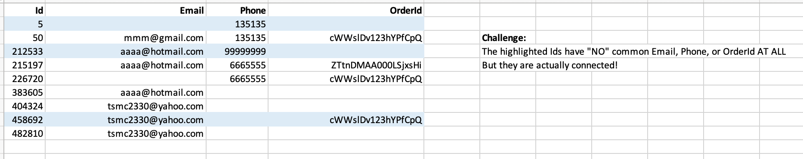
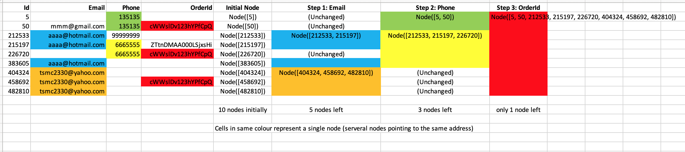

# Shopee Code League 2021 - Multi-channel Contacts Problem
### Solution Summary
- [Union-Find Algorithm](https://algs4.cs.princeton.edu/15uf/)
- implemented using Linked List
- Both time and space complexity being O(n)
- [Try multi-channel-contacts.ipynb in Google Colab!](https://colab.research.google.com/github/KuanHaoHuang/shopee-code-league-2021-multi-channel-contacts-problem/blob/master/multi-channel-contacts.ipynb)
  - Operation done in less than a minute in Google Colab
- [Try multi-channel-contacts_union-find_simplified_version.ipynb in Google Colab](https://colab.research.google.com/github/KuanHaoHuang/shopee-code-league-2021-multi-channel-contacts-problem/blob/master/multi-channel-contacts_union-find_simplified_version.ipynb)
  - More succinct code, but slightly slower than the other version
- [My Blog Post in Mandarin](https://haosquare.com/shopee-code-league-2021-data-analytics/)（中文部落格講解）

### Solution Visualization
(All data shown below are synthesized, instead of real competition data)
#### The Challenging Part

#### Solved with Union-Find Algorithm using Linked List

#### (Simplified Version) Solved with Union-Find Algorithm

